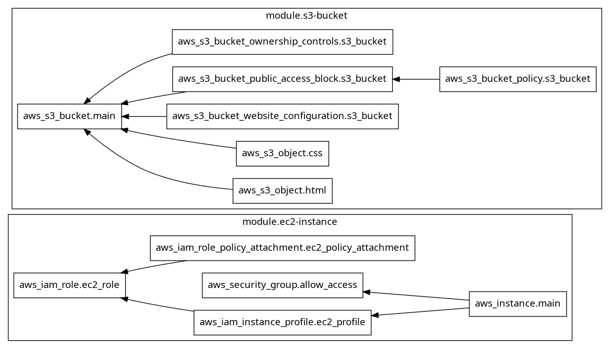

# Simple Web Host using AWS EC2 and S3

## File Structure

```bash
├── terraform
│   ├── modules
│   │   ├── aws-ec2-instance
│   │   │   ├── init_script.sh
│   │   │   ├── main.tf
│   │   │   ├── outputs.tf
│   │   │   └── variables.tf
│   │   └── aws-s3-bucket
│   │       ├── main.tf
│   │       ├── outputs.tf
│   │       └── variables.tf
│   ├── main.tf
│   ├── outputs.tf
│   ├── terraform.tf
│   └── variables.tf
├── web
│   ├── index.html
│   └── style.css
├── display_graph.py
├── README.md
└── terraform_graph.png
```

## AWS Usage

- EC2: Used to host the website using a t2.micro instance.

- S3: Used to store static web files (HTML and CSS).
  
## Terraform Graph


